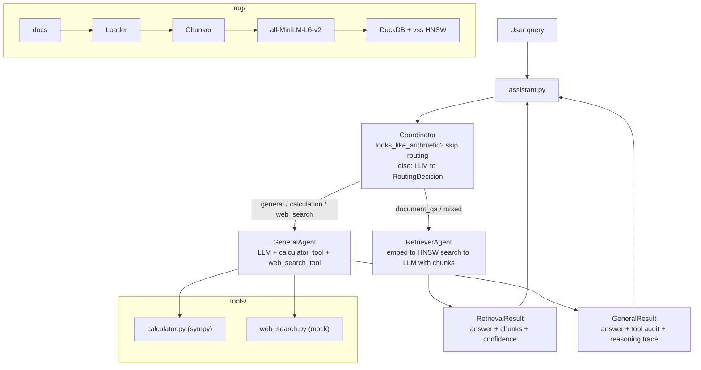

# Research Assistant

Three agents, one CLI: routes your question to the right specialist, shows what it retrieved or calculated, and gives you a traceable answer. Built on Agno 1.4.4, OpenAI (gpt-4o-mini), and DuckDB for the vector store.

## Quick start

```bash
git clone https://github.com/hrshl4codes/research-assistant
cd research-assistant
python -m venv .venv && source .venv/bin/activate
pip install -r requirements.txt

cp .env.example .env
# add your OpenRouter key: OPENROUTER_API_KEY=sk-or-...

python ingest.py                               # build vector store from data/
python assistant.py "What is this doc about?"  # ask a question
python assistant.py --repl                     # or go interactive
```

## How it works



Every agent call appends a line to `logs/trace.jsonl`. The CLI renders the routing decision, retrieved chunks, and tool calls before showing the answer. Nothing is hidden.

## Components

| File | What it does |
|------|--------------|
| `agents/coordinator.py` | Arithmetic pre-filter + LLM routing to `RoutingDecision` |
| `agents/retriever.py` | Embed query, retrieve top-k chunks, answer grounded in evidence |
| `agents/general.py` | LLM with calculator and web_search; audit log tracks actual calls |
| `agents/_llm.py` | Agent factory with primary model and automatic fallback |
| `agents/_prompts.py` | System prompts for all three agents |
| `agents/_tracing.py` | `@trace` decorator, singletons, disk response cache |
| `assistant.py` | CLI: single shot, REPL, `--verbose`, `--agent` flag, Rich output |
| `playground.py` | Agno Playground registration (general agent with tools) |
| `assessments/` | 10-query test set + runner that scores routing and tool accuracy |
| `rag/` | PDF loader, chunker, sentence-transformer embedder, DuckDB store |
| `tools/` | Calculator (sympy) and mock web search, both with Pydantic I/O |
| `schemas/` | Pydantic contracts for every agent input and output |

## Design decisions

**DuckDB + vss instead of a vector service**  
No server, no Docker, no account. The `vss` extension runs HNSW indexing in process. Swapping it for pgvector or Pinecone later is a single file change in `rag/store.py`.

**Distance-based confidence, not model self-report**  
Free tier LLMs are overconfident. Instead of trusting what the model claims, the retriever sets confidence from the top chunk's cosine distance: below 0.30 is high, 0.30 to 0.50 is medium, above 0.50 is low. Reproducible and calibrated.

**Arithmetic pre-filter before the LLM router**  
"What is 12 * 8 + sqrt(81)?" doesn't need a routing API call. A regex matches queries with numbers plus math tokens and no explanatory verbs, and routes them straight to the calculator. False negatives fall through to the LLM router; false positives hit the calculator's own error handling. The pre-filter saves an LLM call on roughly 20 to 30 percent of real queries.

**Tool-call audit log, not model self-report**  
`GeneralAgent` wraps each tool in a closure that records to `call_log` when the tool actually executes. `GeneralResult.tools_used` comes from that log, not from the LLM's narration. Free tier models sometimes claim they used a tool they didn't touch.

**Schema-enforced reasoning**  
`RoutingDecision.reasoning` requires at least 20 characters. A one-word field fails Pydantic validation immediately. The system cannot route without explaining why.

## Tradeoffs

**LLM fallback.** The primary model (`gpt-4o-mini`) falls back to `gpt-3.5-turbo` on failure. When both fail, the coordinator defaults to `document_qa`, which is conservative but predictable. Both models are configurable via `PRIMARY_MODEL` and `FALLBACK_MODEL` in `.env`.

**Mock web search.** `tools/web_search.py` returns canned results from a static dataset, labelled `source="mock_data"`. It works for a handful of topics (RAG, transformers, federated learning) and returns empty for anything outside that set. The interface is real. Swapping in a live search API means changing one function in `web_search.py`.

**Sequential multi-step handling.** Mixed queries run the retriever first, then pass a chunk summary to the general agent. Easier to trace than parallel execution, but slower for compound questions.

## Assessment results

Run `python -m assessments.run` after ingesting documents. Expected routing per case:

| Case | Query (abbreviated) | Expected agent | Expected tools |
|------|---------------------|---------------|----------------|
| doc-01 | What is this document about? | retriever_agent | none |
| doc-02 | Summarize the main contribution | retriever_agent | none |
| doc-03 | Who are the authors? | retriever_agent | none |
| calc-01 | 12 * 8 + sqrt(81)? | general_agent | calculator |
| calc-02 | (1 + sqrt(5)) / 2 | general_agent | calculator |
| gen-01 | Why is the sky blue? | general_agent | none |
| gen-02 | Capital of Australia? | general_agent | none |
| web-01 | What is retrieval augmented generation? | general_agent | web_search |
| mixed-01 | HNSW vs IVF-Flat (doc + general) | mixed | web_search |
| unclear-01 | asdf | none | none |

The two trickiest cases: `web-01` (the model may answer from memory instead of calling web_search) and `mixed-01` (routing to "mixed" requires recognizing a compound query). Calc-01 and calc-02 bypass the router entirely via the pre-filter.

Results go to `logs/assessment-<timestamp>.json`.

## Bonus criteria

| Criterion | Where |
|-----------|-------|
| Query classification before routing | `Coordinator.route()` in `agents/coordinator.py` |
| Avoid unnecessary LLM/RAG calls | `looks_like_arithmetic()` pre-filter in `agents/coordinator.py` |
| Logging and tracing | `@trace` decorator in `agents/_tracing.py` writing to `logs/trace.jsonl` |
| Assessment dataset (10 queries) | `assessments/dataset.json` + `assessments/run.py` |
| Performance: pre-filter, singletons, disk cache | `_tracing.py` (`get_embedder`, `get_store_conn`, `cache_get/put`) |
| Agno Playground UI | `playground.py` (general agent with tools). Playground exposes the general agent only; retrieval requires the CLI. |

## Repository layout

```
research_assistant/
├── agents/
│   ├── coordinator.py     # pre-filter + LLM routing
│   ├── retriever.py       # RAG-grounded Q&A
│   ├── general.py         # tool-using reasoning
│   ├── _llm.py            # agent factory
│   ├── _prompts.py        # system prompts
│   └── _tracing.py        # JSONL trace + singletons + cache
├── rag/                   # loader, chunker, embedder, DuckDB store
├── tools/                 # calculator (sympy), web search (mock)
├── schemas/               # Pydantic contracts for all agent I/O
├── assessments/           # 10-query dataset + runner
├── tests/                 # 16 unit tests (deterministic helpers only)
├── assistant.py           # CLI entrypoint
├── playground.py          # Agno Playground UI
├── ingest.py              # document ingestion
└── logs/                  # trace.jsonl + assessment reports
```

## Running

```bash
# one question
python assistant.py "What does the document say about transformers?"
python assistant.py --agent general "What is 2**10 + sqrt(16)?"
python assistant.py --verbose "Summarize the main contribution."

# interactive
python assistant.py --repl

# assessment
python -m assessments.run --quick   # routing accuracy only, no agent calls
python -m assessments.run           # full run with agent execution

# Agno Playground
python playground.py

# tests
pytest tests/ -v
```

## What's next

- Replace mock web search with a live API (Tavily, Serper). The interface is already there; just swap the backend.
- Add document types beyond PDF: DOCX, HTML, markdown.
- Persist the response cache between sessions.
- Streaming output in the CLI so long answers print incrementally.
- Connect the Playground retriever to the actual vector store.
